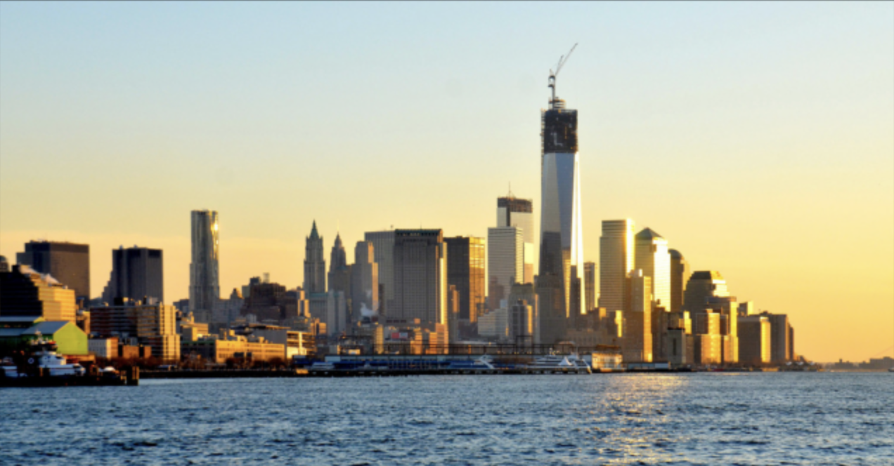
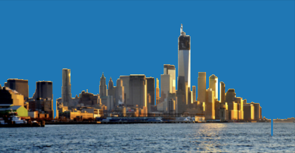
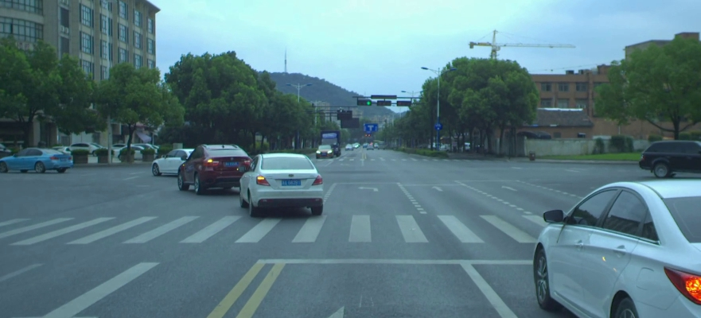
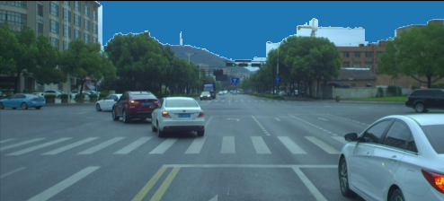
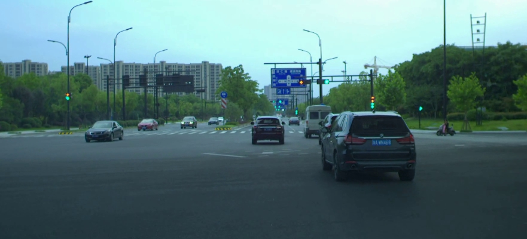
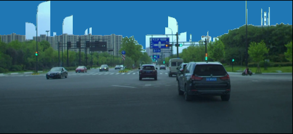

# Image Sky Detection

Non-deep learning sky detector method with DEMO

## Intro

This project uses simple `gradient based` method with `Sobel Edge Detector` to extract sky region of an image 
and then uses `k-means` clustering to refine the detected sky region by removing "fake sky regions".

## Requirements:
```
Python>3.8
cv2
...
More: 
See `requirements.txt`
```
## Run Test:

```python run.py```
```Optional:
You can edit "run.py" to add your image path to test.
```

## DEMO:

DEMO1                     |  OUT
:-------------------------:|:-------------------------:
  |  

DEMO2                   |  OUT
:-------------------------:|:-------------------------:
   |  

DEMO3                     |  OUT
:-------------------------:|:-------------------------:
  |  

## Algorithms:

1. This project uses simple `gradient based` method with `Sobel Edge Detector` to extract sky region of an image 
2. check if we have fake sky (ground object blocks part of the sky)
3. ONLY if 2 is true, we run: following:
4. Uses `k-means` clustering to refine the detected sky region by removing "fake sky regions".

### Optimisation:
The algorithm uses customised Energy Function $J$ to optimise the decision of sky-region divider.

\[ J =  (AVG(Color^{G}_{pixels}) - \gamma * AVG(Color^{S}_{pixels}))\]
OR equivalently:
\[ J = (\frac{1}{N^{S}} \sum_{i=i}^{n^{S}} x^{S}_{i} - \frac{1}{N^{G}} \sum_{j=j}^{n^{G}} x^{G}_{j}) \]

Where S = Sky, G = Ground, $\gamma$ is the penalty (norm) added to sky region.

**Intuition: maximise the difference between sky and ground region's average color.**

##